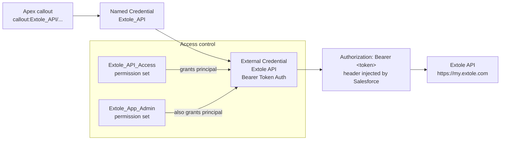
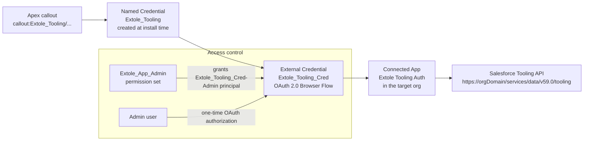
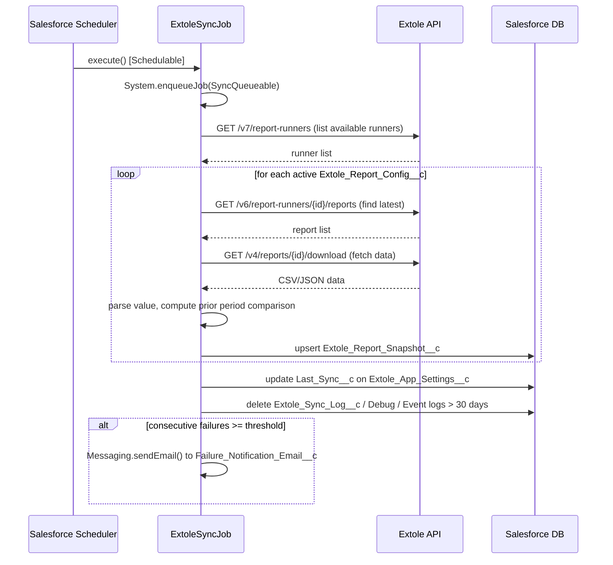
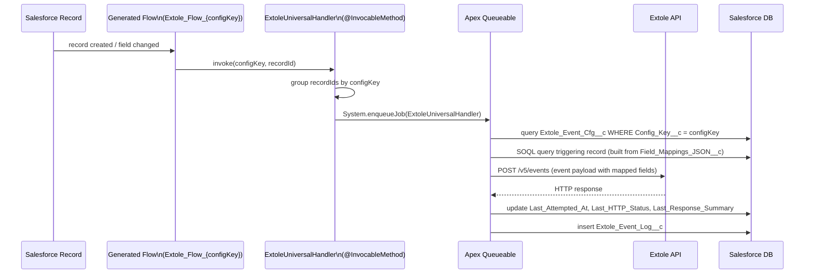
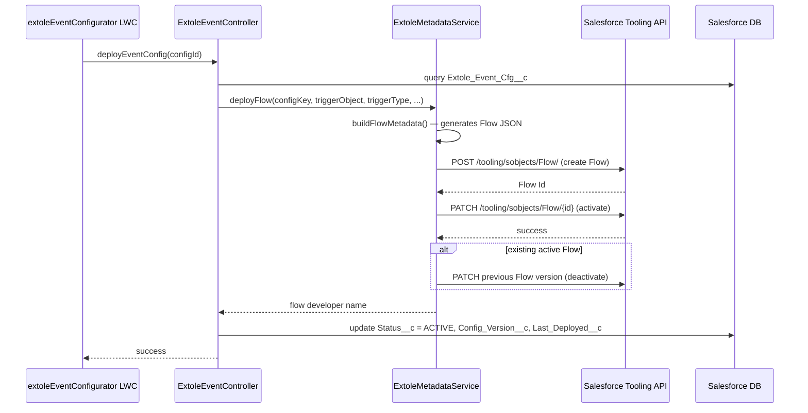

# Extole SFDC App — Internal Architecture

## Overview

The app has two independent features that share a common auth and settings layer:

- **Analytics** — Scheduled Apex job pulls report data from the Extole API and stores it as snapshots. LWC reads snapshots and renders metric tiles.
- **Event Configurator** — Admin defines record-triggered event rules in the UI. The app generates and deploys a Salesforce Flow via the Tooling API. The Flow invokes an Apex handler that sends events to Extole in real time.

---

## Component Map

```
LWC (UI)                    Apex (backend)                  External
─────────────────────────   ──────────────────────────────  ────────────────────
extoleSettings          →   ExtoleController                Extole API (my.extole.com)
extoleKpiDashboard      →   ExtoleController                Salesforce Tooling API
extoleListView          →   ExtoleController
extoleEventConfigurator →   ExtoleEventController
                            ExtoleMetadataService       →   Tooling API
                            ExtoleSafetyCheckService    →   Extole API

Background
──────────────────────────────────────────────────────────
ExtoleSyncJob (Schedulable → Queueable)  →  Extole API
ExtoleUniversalHandler (Queueable)       →  Extole API
  ↑ invoked by generated Record-Triggered Flows
```

---

## Auth Model

The app uses two Named Credentials for all external callouts. No tokens or session IDs appear in Apex code.

### Credential 1 — Extole API

Used for: KPI syncs, event sends, connection test, report runner list, safety check.



**Setup:** Admin generates a long-lived token in the Extole Security Center and pastes it into the External Credential's Authorization parameter in Setup → External Credentials → Extole API → Custom Headers.

**Important:** Deploying the `Extole_API` External Credential metadata resets the token to the placeholder value `REPLACE_WITH_BEARER_TOKEN`. After any deploy that touches this credential, the token must be re-entered manually.

---

### Credential 2 — Salesforce Tooling API

Used for: deploying, deactivating, and deleting Record-Triggered Flows from the Event Configurator.



**Setup:** Created by `scripts/setup_named_credential.sh` during install. Requires a Connected App with callback URL `https://login.salesforce.com/services/authcallback/<orgId>/Extole_Tooling_Cred`. After setup, admin clicks **Authorize** next to the principal in Setup → Named Credentials → Extole Tooling → External Credential Principals.

**Note:** `Extole_Tooling` Named Credential and its External Credential are not in source — they are created at install time and are org-specific (OAuth tokens are per-org).

---

## KPI Sync Flow



**Callout budget:** The job allocates 90 total callouts across all active configs (1 list call per runner + N download calls). If history depth would exceed the budget, `History_Depth__c` is capped dynamically.

**Trend calculation:** Each snapshot stores a `Time_Series_JSON__c` array of `{date, value}` pairs. On each sync, new data points are merged in. The `Comparison_Period__c` field on the config (1/7/14/30/90 days) controls how far back the prior-period value is looked up.

---

## Event Dispatch Flow



**Why Queueable?** Salesforce does not allow HTTP callouts in synchronous transaction context triggered by a Flow. The `@InvocableMethod` enqueues a job, which runs asynchronously with full callout access.

**Record grouping:** If the same Flow fires for multiple records in one transaction (e.g., a bulk update), the handler groups all record IDs into a single Queueable job per config key to minimize job slots consumed.

**Bulk imports >100 records:** Record IDs are chunked into batches of 100 before enqueueing — one Queueable job per chunk. A bulk insert of 150 records enqueues two jobs (100 + 50). This respects the platform's 100-callout-per-Queueable limit.

---

## Event Deploy Flow



**Generated Flow structure:** Each Flow is a Record-Triggered Flow named `Extole_Flow_{configKey}`. It has no logic of its own — it simply calls `ExtoleUniversalHandler.invoke()` passing the static `configKey` and `$Record.Id`.

---

## Data Model

```
Extole_App_Settings__c (org default singleton)
  ├── sync settings (cadence, history depth, last sync)
  ├── notification settings (email, threshold)
  ├── debug flag
  └── list view configuration

Extole_Report_Config__c  (one per KPI tile)
  ├── report type, label, value column, aggregation
  ├── chart type, comparison period
  └── active flag
      └── Extole_Report_Snapshot__c (one per config)
              ├── latest value, prior period value
              ├── time series JSON
              └── config status (ACTIVE / SOURCE_UNAVAILABLE)

Extole_Event_Cfg__c (one per event rule)
  ├── trigger config (object, type, field, values)
  ├── event name, field mappings JSON
  ├── status (DRAFT / ACTIVE / INACTIVE / DEPLOY_FAILED)
  ├── runtime telemetry (last attempted, succeeded, failed, HTTP status)
  └── Extole_Event_Log__c (one per event fired)

Extole_Sync_Log__c (one per sync run per config)
Extole_Debug_Log__c (one per log entry when debug enabled)
```

**Log retention:** All three log objects are purged to 30 days on every sync run.

---

## Apex Classes

| Class | Role |
|---|---|
| `ExtoleController` | LWC backend for Settings and Analytics — settings CRUD, sync trigger, report config CRUD, connection test |
| `ExtoleEventController` | LWC backend for Event Configurator — event config CRUD, deploy, test fire, safety check |
| `ExtoleMetadataService` | Tooling API integration — builds Flow metadata JSON, deploys/deactivates/deletes Flows |
| `ExtoleSyncJob` | Schedulable + Queueable sync job — fetches report data from Extole, upserts snapshots, purges logs, sends failure emails |
| `ExtoleUniversalHandler` | Queueable @InvocableMethod — invoked by generated Flows, sends events to Extole API, updates telemetry |
| `ExtoleSafetyCheckService` | Checks whether an event name is referenced by an active Extole campaign before allowing deletion |
| `ExtoleToolingService` | Legacy per-config Apex class generator — **no longer used**; superseded by `ExtoleUniversalHandler`. Do not delete without first confirming no orphaned generated classes remain in the org. |

---

## Key Behaviors for Maintainers

**Bearer token reset on deploy** — Deploying `Extole_API.externalCredential-meta.xml` resets the Authorization header to a placeholder, causing immediate 401 errors. This is a Salesforce platform constraint: secrets are never exported in metadata and any deploy of the file overwrites the live value with whatever is in source (a placeholder). Both `externalCredentials/` and `namedCredentials/` are excluded in `.forceignore` to prevent this from happening during normal code deploys. These files should be treated as install-time-only artifacts — configure once manually, never redeploy. If the credential structure itself genuinely needs to change, update it directly in Setup rather than via a metadata deploy.

**Tooling OAuth session expiry** — If the `Extole_Tooling_Cred-Admin` principal's OAuth token expires or is revoked, all Flow deploys will fail with an auth error. Fix: Setup → Named Credentials → Extole Tooling → External Credential Principals → Authorize.

**Sync job re-registration** — Changing the Sync Cadence setting reschedules `ExtoleSyncJob` automatically. If for any reason the job gets stuck or duplicated, abort it in Setup → Apex Jobs → Scheduled Jobs, then re-save any setting in the app to reschedule it.

**Flow naming** — Generated Flows are named `Extole_Flow_{configKey}`. The `configKey` is a stable identifier stored on `Extole_Event_Cfg__c.Config_Key__c`. Renaming or manually editing generated Flows in Setup will break the delete/deactivate path in the app.
